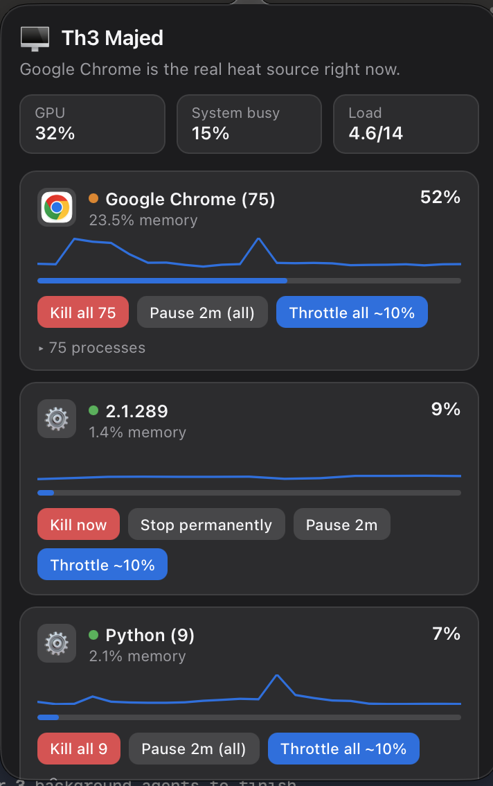

# Th3 Majed

**A menu bar app for macOS that shows you exactly what's making your laptop hot — and lets you do something about it, instantly.**

Th3 Majed lives quietly beside the clock. Click it, and instead of a wall of numbers it gives you one plain-English sentence ("Google Chrome is the real heat source right now") plus a live, grouped breakdown of what's actually driving your CPU and GPU — with a real control in front of every single one of them: **Kill it. Stop it permanently. Pause it for a while. Or throttle it to ~10% CPU.** No more opening Activity Monitor, squinting at a flat list of 400 processes, and guessing.



## Why this matters if you work with AI tools, agents, and automation all day

If you're running coding agents, local models, multiple browser tabs full of AI tools, Docker containers, background indexers, and a dozen other things at once — which is now just normal life for anyone building with AI — your laptop is under a completely different kind of load than it used to be. Agents spawn subprocesses. Local inference servers peg a core for minutes at a time. Browser tabs running AI web apps quietly multiply into dozens of helper processes. Background indexing (Spotlight, Photos analysis, iCloud sync) picks the worst possible moment to kick in.

The result: your Mac gets hot, the fans spin up, everything feels sluggish — and you have no idea *why*, or which of the twelve things you have open is actually responsible, or whether it's safe to just kill it.

Th3 Majed exists for exactly this. It's built for people who **stay in control of their own machine** instead of just tolerating the heat — you see what's responsible in one glance, and you decide, right there, whether to let it keep running, pause it, throttle it back, or shut it down. No more being at the mercy of whatever background process decided to peg a core.

## What it actually does

- **Grouped by app, not by PID.** Chrome spawning 70 helper processes shows up as one "Google Chrome" card, not 70 identical rows. Click to drill into the individual processes if you need to.
- **Live, smoothed trend graphs** per app, so a one-second spike doesn't send you chasing a ghost.
- **Real GPU reading** (via IOKit, no admin password needed) and a system-busy/load indicator — not fake numbers.
- **One-line plain-English verdict** at the top of the panel, updated live.
- **Four real controls on every process:**
  - **Kill now** — immediate, with a confirmation dialog.
  - **Stop permanently** — for background services (launchd agents/daemons), attempts to disable them properly via `launchctl`, not just kill-and-hope. If macOS's System Integrity Protection blocks it (some system services can't be disabled), it tells you honestly and offers to throttle instead.
  - **Pause for a while** — freezes the process (SIGSTOP) for 30s / 2min / 10min, then auto-resumes. Nothing is lost; the process just doesn't run meanwhile.
  - **Throttle to ~10% CPU** — keeps a process alive and working, but caps how much of your CPU it's allowed to use, via a duty-cycled suspend/resume. Useful for background daemons macOS won't let you fully disable.
- **Protected by design:** processes your whole session depends on (`WindowServer`, `loginwindow`, `launchd`, `kernel_task`, `SystemUIServer`) simply refuse Kill/Stop/Pause — there's no button that can accidentally log you out or crash your Mac.
- **Crash-safe:** every pause/throttle is logged to disk the moment it starts. If Th3 Majed itself is force-quit or crashes, the *next* launch automatically resumes anything it left frozen — nothing can stay stuck forever just because the watchdog went away.
- **Full audit log** of every action taken, with exact PIDs and timestamps — no silent process-pattern matching that could hit the wrong target.

## Install

1. Download the latest `Th3Majed.dmg` from the [Releases page](../../releases).
2. Open it, drag **Th3 Majed** into **Applications**.
3. Launch it from Applications (or Spotlight). It has no Dock icon by design — it only ever lives in the menu bar.
4. **First launch only:** since this isn't signed with a paid Apple Developer certificate, Gatekeeper will say the app "cannot be verified." Right-click (or Control-click) the app → **Open** → **Open** again in the dialog. You only need to do this once.

That's it — click the icon beside your clock any time to see what's running.

### Run it automatically at login (optional)

System Settings → General → Login Items → add **Th3 Majed**. (Or ask it to be scripted via a LaunchAgent if you prefer — see `com.majed.th3majed.plist` pattern in the source.)

## Requirements

- macOS 13 (Ventura) or later
- **Apple Silicon (M1/M2/M3/M4...)**. This build is arm64-only. (Intel support would just mean building on an Intel Mac — the source has no Apple-Silicon-specific code.)

## How it reads your system (and what it honestly can't)

- **CPU per process:** real, via `psutil`, smoothed over a short rolling window.
- **GPU:** real, system-wide utilization via IOKit's `IOAccelerator` performance statistics — no admin rights needed. It's not broken down per-process because macOS doesn't expose that without a privileged helper, so Th3 Majed doesn't pretend to.
- **"Thermal pressure":** approximated from overall system busy-% and load-per-core, not a real temperature sensor — macOS doesn't expose chip temperature without elevated/signed access on Apple Silicon. No fake numbers here either.

## Uninstall

```bash
# If you added it as a login item: System Settings → General → Login Items → remove it.
# If you set it up as a LaunchAgent:
launchctl bootout gui/$(id -u)/com.majed.th3majed
rm ~/Library/LaunchAgents/com.majed.th3majed.plist

rm -rf /Applications/Th3Majed.app
```

## Building from source

```bash
git clone https://github.com/VercaaLLC/Th3-Majed.git
cd Th3-Majed
./build.sh
```

This produces `dist/Th3Majed.app` (fully standalone — no system Python dependency) and `Th3Majed.dmg`.

Requires Xcode Command Line Tools with the license accepted (`xcode-select --install`, then `sudo xcodebuild -license accept` if you haven't already agreed to it).

## Project layout

| File | What it is |
|---|---|
| `th3majed.py` | The AppKit shell — status item, popover, WebView, and the JS↔Python bridge. |
| `engine.py` | All the actual logic: metrics, grouping, safety guards, and every process action. No UI code. |
| `panel.html` | The panel itself — plain HTML/CSS/JS rendered in a `WKWebView`. |
| `make_icon.py` | Generates the app icon natively via AppKit (no external image tools). |
| `Th3Majed.spec` | PyInstaller build spec — produces the standalone `.app`. |
| `build.sh` | One-command build: venv → freeze → `.dmg`. |

## License

MIT — see [LICENSE](LICENSE).
